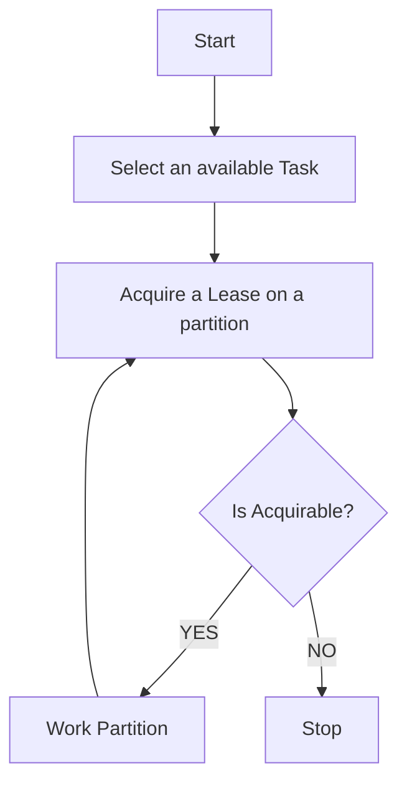

# Jobs

Un Job &egrave; costituito da una sequenza di Task. Al momento non ha neanche una identit&agrave; precisa: ovvero non essiste un documento Job ma solo un jobId.
Un Task ha una struttura di questo tipo:

- e' caratterizzato da un type: in questo caso q-mongo per indicare il tipo di worker che lo potr&agrave; lavorare e la logica
- ha uno stato
- possiede delle informazioni dipendenti dal tipo di task: nell'esempio successivo i riferimento alla collection mongo-db sulla quale operare le interrogazioni.
- pu&ograve; essere `finite` oppure `infinite`: un task _infinito_ indica che i documenti da lavorare vengono man mano inseriti nella collection e la lavorazione non termina mai.

Un task &egrave; caratterizzato da un certo numero di partizioni: 

- esse hanno uno stato
- specificano (nel caso q-mongo) una query da eseguire per ottenere i record; questa query pu&ograve; essere abbastanza qualsiasi ma deve considerare che
  * l'elaborazione deve essere eseguita per _id crescenti 
  * viene utilizzato l'_id per progredire nella scansione del data set. 

Nell'esempio riportato la query `{ "$and": [ {"_np": 1 }, { "_id": { "$gt": { "$oid": "{resumeObjectId}" } } }  ] }` si nota che la query &egrave; costruita con una condizione utile per il partizionamento dei record (in questo caso un 
campo destinato all'uopo ma puo' essere qualsiasi altra cosa) in and con una condizione particolare che viene valorizzata durante la lavorazione (nota: all'inizio il `resumeObjectId` sar&agrave; valorizzato a zero).

```json
{
  "_id": {
    "$oid": "6822f3f2f89695833ce6b145"
  },
  "_bid": "jobId-t1",
  "_et": "task",
  "status": "available",
  "typ": "q-mongo",
  "data_stream_type": "infinite",
  "jobBid": "my-job-id",
  "info": {
    "mdbInstance": "default",
    "mdbCollection": "query-collection"
  },
  "partitions": [
    {
      "_bid": "jobId-t1:001",
      "_et": "task",
      "partitionNumber": 1,
      "status": "available",
      "etag": {
        "$numberLong": "0"
      },
      "info": {
        "mdbFilter": "{ \"$and\": [ {\"_np\": 1 }, { \"_id\": { \"$gt\": { \"$oid\": \"{resumeObjectId}\" } } }  ] }"
      }
    },
    {
      "_bid": "jobId-t1:002",
      "_et": "task",
      "partitionNumber": 2,
      "status": "available",
      "etag": {
        "$numberLong": "0"
      },
      "info": {
        "mdbFilter": "{ \"$and\": [ {\"_np\": 2 }, { \"_id\": { \"$gt\": { \"$oid\": \"{resumeObjectId}\" } } }  ] }"
      }
    },
    {
      "_bid": "jobId-t1:003",
      "_et": "task",
      "partitionNumber": 3,
      "status": "available",
      "etag": {
        "$numberLong": "0"
      },
      "info": {
        "mdbFilter": "{ \"$and\": [ {\"_np\": 3 }, { \"_id\": { \"$gt\": { \"$oid\": \"{resumeObjectId}\" } } }  ] }"
      }
    },
    {
      "_bid": "jobId-t1:004",
      "_et": "task",
      "partitionNumber": 4,
      "status": "available",
      "etag": {
        "$numberLong": "0"
      },
      "info": {
        "mdbFilter": "{ \"$and\": [ {\"_np\": 4 }, { \"_id\": { \"$gt\": { \"$oid\": \"{resumeObjectId}\" } } }  ] }"
      }
    },
    {
      "_bid": "jobId-t1:005",
      "_et": "task",
      "partitionNumber": 5,
      "status": "available",
      "etag": {
        "$numberLong": "0"
      },
      "info": {
        "mdbFilter": "{ \"$and\": [ {\"_np\": 5 }, { \"_id\": { \"$gt\": { \"$oid\": \"{resumeObjectId}\" } } }  ] }"
      }
    }
  ]
}
```

La logica di lavorazione del worker &egrave-; semplificata nella maniera seguente:



La lavorazione della partizione 

- avviene a blocchi
- viene effettuata una query separata per blocco utilizzando l'_id come offset per muoversi all'interno del dataset (da cui l'esigenza di muoversi in questo modo)

Quando un worker ha terminato la lavorazione di una partizione (ovvero ha finito i dati disponibili) 

* se `data_stream_type == "infinite"` allora termina semplicemente ma la partizione viene lasciata nello stato precedente `available`
* se `data_stream_type == "finite"` allora termina semplicemente ma la partizione viene contrassegnata come `EOF`: una partizione contrassegnata con EOF non viene 
pi&ugrave; lavorata.

Come si pu&ograve; osservare dallo schema proposto esistono due temi evidentemente sospesi in questo tipo di lavorazione:

1. in caso di lavorazione di un task `finite` le partizioni vengono poste ad EOF ma il task rimane available e quindi soggetto a successiva ed inutile presa in carico.
2. chi lavora effettivamente i documenti (e' stata illustrata la modalità di scansione del dataset ma non l'effettiva lavorazione)
3. come viene effettuata la lavorazione degli errori.

Il worker non &egrave; l'unico soggetto che partecipa alla lavorazione di un task ma esiste anche il `driver`. Il `driver` &egrave; un componente (co-locato nello stesso ms del worker)
che si occupa di eseguire la transizioni di stato dei task: peridicamente verifica se tutte le partizioni sono EOF e 'chiude' il task.
Ora il `driver` in realt&agrave; ha anche un altro ruolo: quello di popolare eventualmente i task: 

- supponiamo uno scenario nel quale abbiamo
un workflow che deve prima eseguire un task e poi eseguire un secondo task: &egrave; necessario che un 'vigile' chiuda un task esaurito ed attivi un task successivo
- oppure ipotizziamo che ci sia qualche logica time dependent e quindi deve creare task in base alla giornata.

Questo genere di attivit&agrave; sono separate dal worker per ovvii motivi avendo una variabilit&agrave; poco controllabile e in generale anche passibili di essere eseguite da un microservizio 
esterno.

Chi lavora effettivamente i documenti? Il worker pu&ograve; essere configurato con un componente esterno che implementa una interfaccia definita e si occupa di attuare le lavorazioni vere e proprie e anche di ritornare errori.

## Worker e Consumer
Il _worker_ &egrave; organizzato in due sotto-componenti:

* un worker vero e proprio che si occupa di ottenere il task e invocare la lavorazione dei documenti
* un consumer del dataset cui viene passato il task e si occupa di pollarlo per ritornare i documenti al worker vero e proprio.

Il consumer ha una metafora di commit che permette di salvare l'_id dell'ultimo documento lavorato correttamente secondo una logica di lavorazione ad offset.


